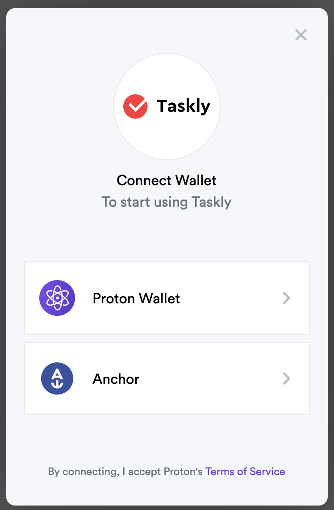

# Proton Web SDK

::: tip Contribute
If you would like to contribute to our open source code, you can do so [here](https://github.com/ProtonProtocol/ProtonWeb)
:::

## Installation
npm
```
npm i @proton/web-sdk
```

yarn
```
yarn add @proton/web-sdk
```

## Instantiation

To use and instantiate, first import the ProtonWebSDK function from the SDK.&#x20;

```ts
import ProtonWebSDK from '@proton/web-sdk'
```

The following is a list of arguments that ProtonWebSDK accepts:

| Argument         | Type   | Required | Effect                                                      |
| ---------------- | ------ | -------- | ----------------------------------------------------------- |
| linkOptions      | Object | true     | Customize options for communication with chain              |
| transportOptions | Object | false    | Customize options for transport (communication with client) |
| selectorOptions  | Object | false    | Customize display options for wallet selection              |

### **linkOptions:**

| Key            | Type        | Required | Description                                                                                                                                     |
| -------------- | ----------- | -------- | ----------------------------------------------------------------------------------------------------------------------------------------------- |
| endpoints      | array       | true     | List of chain API endpoints. Only one endpoint is needed, but the function accepts an array of multiple endpoints for fault tolerance                                                                                                                     |
| chainId        | string      | false    | Chain ID or PSR chain name alias for which the link is valid                                                                                    |
| storage        | LinkStorage | false    | Storage interface (see below)                                                                                                                   |
| storagePrefix  | string      | false    | Optional prefix added to key names of stored items if default storage is used                                                                   |
| restoreSession | boolean     | false    | Determine if connection request is to restore a saved session. This will not prompt the wallet selector modal to pop up if restoring a session. |


_Custom Storage_

By default, the SDK will use local storage with a default prefix of 'proton-storage.' The implementation can be found on [Github](https://github.com/ProtonProtocol/ProtonWeb/blob/master/packages/proton-web-sdk/src/index.ts).&#x20;

In order to use a custom storage method, please implement the following interface.

```
export interface LinkStorage {
    /** Write string to storage at key. Should overwrite existing values without error. */
    write(key: string, data: string): Promise<void>
    /** Read key from storage. Should return `null` if key can not be found. */
    read(key: string): Promise<string | null>
    /** Delete key from storage. Should not error if deleting non-existing key. */
    remove(key: string): Promise<void>
}
```

### transportOptions:

| Key            | Type    | Description                                                                                                                                                                                                                                          |
| -------------- | ------- | ---------------------------------------------------------------------------------------------------------------------------------------------------------------------------------------------------------------------------------------------------- |
| requestAccount | string  | <p>Account that is requesting the transaction with client</p><p><em>*Will most likely be the same as appName</em></p><p><em>**Optional, but will display "Unknown Requestor' in transaction request if no value is given</em></p> |
| backButton     | boolean | Option to disable the back button in transport modal to return to wallet selector modal. Automatically shows the back button unless specified to `false`.                                                                                            |

### selectorOptions:

| Key                | Type   | Description                                                                                                                                                                                                                                                             |
| ------------------ | ------ | ----------------------------------------------------------------------------------------------------------------------------------------------------------------------------------------------------------------------------------------------------------------------- |
| appName            | String | Name of app to display in wallet selector                                                                                                                                                                                                                               |
| appLogo            | String | Logo image of app to display in wallet selector                                                                                                                                                                                                                         |
| customStyleOptions | Object | Custom styles for the wallet selector modal for further customization. This is an optional object to pass in. If nothing is passed in, it will default to a white modal. This is particularly useful if you would like to change the background for dark mode websites. |
| enabledWalletTypes | Array | Array of wallet types to show for login: `proton` for Mobile wallet, `webauth` for browser wallet and `anchor` for desktop wallet |

_Custom Styling for Wallet Selector Modal_

The wallet selector modal can be customized like so with the following example:



```
customStyleOptions: {
    modalBackgroundColor: '#F4F7FA',
    logoBackgroundColor: 'white',
    isLogoRound: true,
    optionBackgroundColor: 'white',
    optionFontColor: 'black',
    primaryFontColor: 'black',
    secondaryFontColor: '#6B727F',
    linkColor: '#752EEB'
};
```

## Usage

### Class Initialization

```ts
class ProtonSDK {
  constructor() {
    this.chainId = process.env.REACT_APP_CHAIN_ID;
    this.endpoints = [process.env.REACT_APP_CHAIN_ENDPOINT]; // Multiple for fault tolerance
    this.appName = 'appName';
    this.requestAccount = 'accountName'; // optional
    this.session = null;
    this.link = null;
  }
```

The above is an example using React.js to serve as reference for the methods below.

### Login

Using the return value from ProtonWebSDK, call the method with the _appName_ as an argument. Not supplying an _appName_ will cause the login request to display 'Unknown requestor' as the requestor.&#x20;

```ts
login = async () => {
    try {
      const { link, session } = await ProtonWebSDK({
        linkOptions: { chainId: this.chainId, endpoints: this.endpoints },
        transportOptions: { requestAccount: this.requestAccount, backButton: true },
        selectorOptions: { appName: this.appName, appLogo: appLogo}
      });
      this.link = link;
      this.session = session;
      return { auth: session.auth };
    } catch (e) {
      return e;
    }
  }
```

The session information should be stored to call other ProtonWebSDK methods.&#x20;

`session.auth` contains `actor` and ` permission` information required to approve a transaction and other ProtonWebSDK methods.\


### Transaction

To initiate a transaction, use the `transact` method.&#x20;

```ts
sendTransaction = async (actions) => {
    try {
      const result = await this.session.transact(
        { actions: actions },
        { broadcast: true }
      );
      return result;
    } catch (e) {
      return e;
    }
  }
```

The `actions` key takes in an Array of transactions to send to the client for approval. The `broadcast` key determines if the transaction is to be broadcasted, or to simply return the signature.

#### Actions

A transaction action object takes the following form.&#x20;

```ts
const actions = [{
        account: 'xtokens',
        name: 'transfer',
        authorization: [{
          actor: actor,
          permission: permission
        }],
        data: {
            from: actor,
            to: ProtonSDK.requestAccount,
            quantity: '1.000000 XUSDT',
            memo: 'memo'
        }
      }];
```

The `account` value is the token contract for the token being exchanged. In the example above, the token being exchanged is XUSDT for which the token contract is `xtokens`.&#x20;

The actor and permission values can be destructured from the `session.auth` value from `login`.\
The `memo` value serves as additional details attached to the transaction, but does not affect the transaction.&#x20;


> For any transactions with `X` wrapped tokens, the account must be set to `xtokens`
> 
> For all other transactions including `XPR`, the account must be set to `eosio.tokens`

FOOBAR token is a test token that can be used for testing purposes on Proton Chain mainnet. This token is dispensed for free at the [Foobar Faucet](https://foobar.protonchain.com). For any transactions with FOOBAR token, please reference the code block below.

```ts
const actions = [{
        account: 'xtokens',
        name: 'transfer',
        authorization: [{
          actor: actor,
          permission: permission
        }],
        data: {
            from: actor,
            to: ProtonSDK.requestAccount,
            quantity: '5.000000 FOOBAR',
            memo: 'memo'
        }
      }];
```

| Account     | Decimal Places For Transactions | Examples Tokens |
| ----------- | ------------------------------- | --------------- |
| xtokens     | 6                               | FOOBAR, XUSDT   |
| eosio.token | 4                               | XPR             |

### Logout

To logout, call the `logout` method with `appName` and `sesstion.auth` as arguments.

```ts
logout = async () => {
    await this.link.removeSession(this.requestAccount, this.session.auth);
  }
```

### &#x20;Restore Session

To restore a previous session, call the ProtonWebSDK function similar to login, but set the `restoreSession` key as true in `linkOptions`. Since it is not necessary to show wallet selector modal when restoring a session, this function will not display the modal selector.

```ts
restoreSession = async () => {
    try {
      const { link, session } = await ProtonWebSDK({
        linkOptions: { chainId: this.chainId, endpoints: this.endpoints, restoreSession: true},
        transportOptions: { requestAccount: this.requestAccount },
        selectorOptions: { appName: this.appName, appLogo: appLogo, showSelector: false}
      });
      this.link = link;
      this.session = session;

      if (session) {
        return { auth: this.session.auth };
      } else {
        return { auth: { actor: '', permission: '' }};
      }
    } catch(e) {
      return e;
    }
  }
}
```

If there is no saved session or if saved session information is incomplete, the ProtonWebSDK function will return { null, null } and will remove any remaining saved information to remove unexpected side effects.