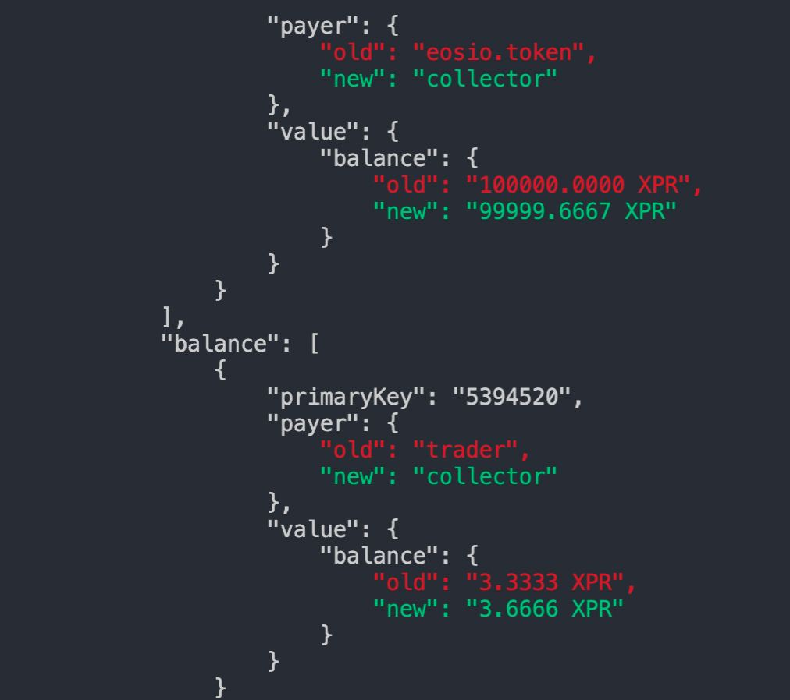

# Testing

## Overview

For testing, Proton smart contracts use `VeRT`, a blockchain virtual machine emulator. 

It uses the built-in WebAssembly object in JavaScript, so can be executed on any modern browsers or runtime environments without additional dependencies. The focus of VeRT is on the better compatibility than the performance, so it can be integrated with development pipelines.

Example complete test [here](https://github.com/jafri/ascdk-minimal/blob/9583a5d3d8ad8df2f1f52a21436a23c922abc546/assembly/escrow/escrow.spec.ts)

## Benefits
- Run and test smart contracts
- Minimum dependencies (No native wrapper, docker or remote connection)
- Volatile key-value store with state rollback


## Requirements
- WebAssembly binary with the exported memory
- JavaScript runtime with WebAssembly BigInt support (nodejs v16 or higher)

## Installation
```
npm install @proton/vert proton-tsc
npm install --save-dev ts-node mocha chai
```

## Run a test
```
npx cross-env LOG_LEVEL=debug mocha -s 250 mytest.spec.ts -r ts-node/register
```

## Common Usage

#### Create new blockchain
```ts
import { Blockchain } from "@proton/vert";

const blockchain = new Blockchain()
```


#### Create new accounts / contracts
```ts
// Accounts
const [account1, account2] = blockchain.createAccounts('account1', 'account2')

// Contract
const mycontract = blockchain.createContract('mycontract', 'target/mycontract.contract')
```

#### Token contract helper
```ts
import { mintTokens } from "@proton/vert"

const tokenContract = blockchain.createContract('xtokens', 'node_modules/proton-tsc/external/xtokens/xtokens')

// Runs before each test
beforeEach(async () => {
  // Delete all existing rows
  blockchain.resetTables()

  // 1. Creates test XUSDC tokens with 1,000,000.000000 XUSDC max supply
  // 2. Issue 100,000.000000 XUSDC to both account1 and account2
  await mintTokens(tokenContract, 'XUSDC', 6, 1000000, 100000, [account1, account2])
})
```

#### Execute an action
```ts
// "describe" formats tests into sections
describe('Test 1', () => {
    await tokenContract.actions.transfer(['account1', 'account2', '1.000000 XUSDC', 'sending']).send('account1@active')

    // Same action, more descriptive
    // Action sent using xtokens@active permission
    // Action data parameters can be provided as an array or with named object
    await tokenContract.actions.transfer({
        from: 'account1',
        to: 'account2',
        quantity: '1.000000 XUSDC',
        memo: 'sending'
    }).send('account1@active')
})
```

#### Read console
```ts
import { expect } from "chai";

describe('Test 1', () => {
    await tokenContract.actions.transfer(['account1', 'account2', '1.000000 XUSDC', 'sending']).send()
    expect(tokenContract.bc.console).to.be.equal('3') // will fail since `transfer` action does not print() anything
})
```

#### Read table storage and expect values
```ts
import { expect } from "chai";
import { nameToBigInt, symbolCodeToBigInt } from "@proton/vert"

const getAccount = (accountName: string, symcode: string) => {
  const accountBigInt = nameToBigInt(Name.from(accountName));
  const symcodeBigInt = symbolCodeToBigInt(Asset.SymbolCode.from(symcode));
  return tokenContract.tables!.accounts(accountBigInt).getTableRow(symcodeBigInt)
}

describe('Test 1', () => {
    expect(getAccount('account1', 'XUSDC')).to.be.deep.equal(account('100000.000000 XUSDC'))
    expect(getAccount('account2', 'XUSDC')).to.be.deep.equal(account('100000.000000 XUSDC'))

    await tokenContract.actions.transfer(['account1', 'account2', '1.000000 XUSDC', 'sending']).send()

    expect(getAccount('account1', 'XUSDC')).to.be.deep.equal(account('99999.000000 XUSDC'))
    expect(getAccount('account2', 'XUSDC')).to.be.deep.equal(account('100001.000000 XUSDC'))
})
```

#### Expect to throw
```ts
import { expect } from "chai";
import { expectToThrow, eosio_assert } from "@proton/vert"

describe('Test 1', () => {
    expectToThrow(
        tokenContract.actions.transfer(['account1', 'account2', '100001.000000 XUSDC', 'sending']).send(),
        eosio_assert('overdrawn balance')
    )
})
```

#### Full test
```ts
import { expect } from "chai";
import { Blockchain, expectToThrow, mintTokens, protonAssert } from "@proton/vert"

const blockchain = new Blockchain()
const [account1, account2] = blockchain.createAccounts('account1', 'account2')
const tokenContract = blockchain.createContract('xtokens', 'node_modules/proton-tsc/external/xtokens/xtokens')

beforeEach(async () => {
  blockchain.resetTables()
  await mintTokens(tokenContract, 'XUSDC', 6, 1000000, 100000, [account1, account2])
})

describe('Test 1', () => {
    expectToThrow(
        tokenContract.actions.transfer(['account1', 'account2', '100001.000000 XUSDC', 'sending']).send(),
        protonAssert('overdrawn balance')
    )
})
```

### Print Storage Deltas
```ts

describe('Test 1', () => {
    blockchain.enableStorageDeltas()
    await contract.actions.transfer(['trade', 'collector', '0.3333 XPR', 'memo']).send()
    blockchain.printStorageDeltas()
    blockchain.disableStorageDeltas()
})
```

Example Result:




### Print All Table Rows

Use printStorage inside the contract and run your tests with LOG_LEVEL=debug

```ts
import { printStorage } from 'proton-tsc'

@contract
export class TestContract extends Contract {
    @action("test")
    test(): void {
        printStorage()
    }
}
```
