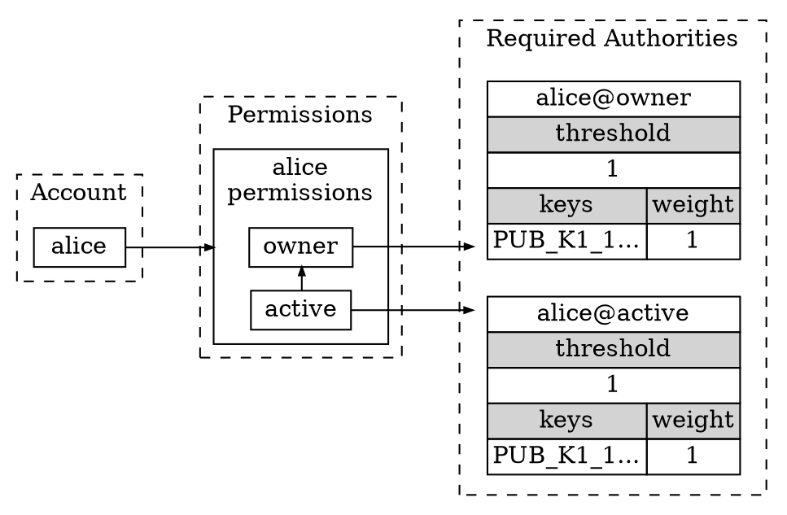
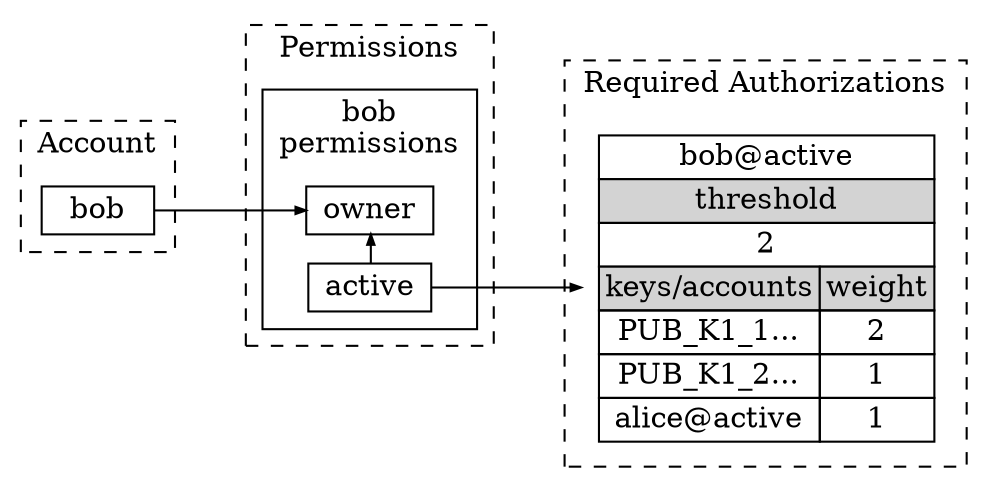
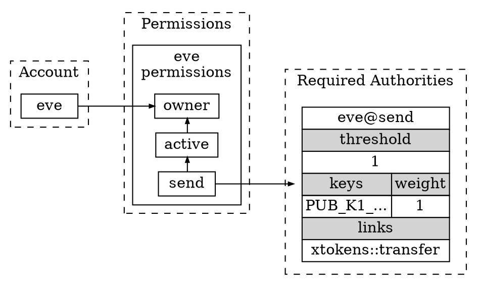

# Accounts and Permissions

## Overview

**Account** - A registered user on the Proton blockchain, that can send transactions to interact with smart contracts.

**Contract** - An account with a smart contract (WASM + ABI) deployed to it.

**Permissions** - A list of authorities associated with an account, with minimum thresholds to authorize a transaction.

**Transaction (TX)** - An array of actions submitted to the blockchain by an account.

**Authority** - A key or account that contributes X weight towards authorizing a permission.

## Permission structure

1. Permission Name
    - account-level unique name
2. Parent
   - typically active/owner
   - parent is empty for owner permission
   - permissions can only use and modify authorizations of themselves and their nested child permissions
3. Required Authorities
   - list of keys and/or accounts
   - weight of authority
4. Threshold
   - The minimum aggregate authorities weight needed to authorize a permission

## Default Account
New Proton accounts start with 2 permissions, the `owner` permission and it's child `active`. 

Let's have a look at the permission structure of a brand new Proton account, alice:

Since both of alice's permissions have a threshold of 1 and `PUB_K1_1...` key has a weight of 1, signing with `PUB_K1_1...` would authorize both her owner and active permissions.

## Advanced Account
Next, let's have a look at a more advanced permission structure, for bob:

Bob's active permission has 2 keys and 1 account and the threshold of the active permission is 2. 

To submit a TX to the Proton blockchain using bob@active permission, the TX must be signed using by either:
- The `PUB_K1_1...` key

  OR 

- Both the `PUB_K1_2...` key and `alice@active`

In the latter case, the blockchain would recursively require signing by the keys and accounts needed to authorize alice@active

## Linked Account
By utilizing permission links, we can limit the actions a specific permission can take.

The 2 types of permission linking possible on Proton are:
1. Link to a specific contract
   - e.g. link to `xtokens` to perform any action on the xtokens contract
2. Link to a specific contract and action
   - e.g. link to `xtokens::transfer` to only perform transfer action on the xtokens contract

Lets have a look at eve's account:

By linking `eve@send` to `xtokens::transfer`, this permission can now only execute 2 tasks:
1. `transfer` action on the `xtokens` contract
2. Update the authorities for `eve@send`

Note the last point, permissions can always update their own authorities, even if linked to a specific action.

After linking, if eve tried executing a `xtokens::abc` or `abc:transfer` action signed with `eve@send` permission, it would fail.
